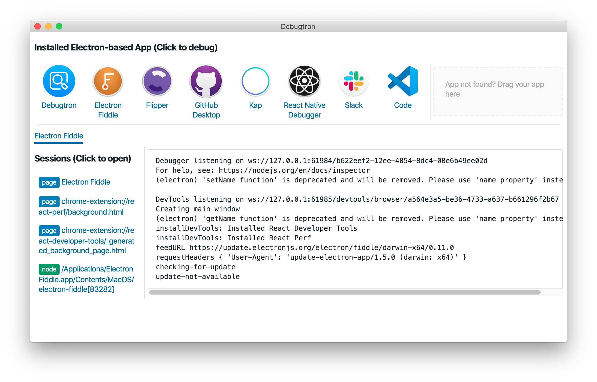

# Debugtron
**本作品修改于：[https://github.com/pd4d10/debugtron](https://github.com/pd4d10/debugtron)，没有@pd4d10的付出就没有本作品

## 本应用对于原作品做出了如下修改
1. 将内部英文译为简体中文
2. 更新electron，更改其打包方式
3. 美化UI
4. 文件结构，及webpack配置项的调整

再次感谢@pd4d10的付出！

Debugtron is an app to debug in-production Electron based app. It is also built with Electron.

## Installation

Installation binaries are available at [release page](https://github.com/bytedance/debugtron/releases).

## License

MIT
